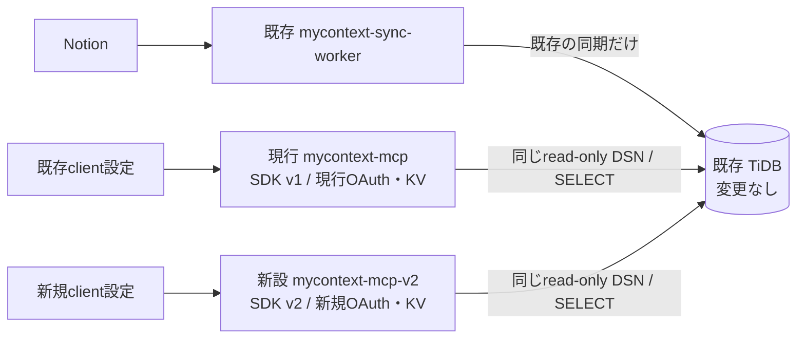

# MCP 2026-07-28 / TypeScript SDK v2 並行新設移行設計

作成日: 2026-07-30

改訂日: 2026-07-30

状態: Phase 0のproduction source provenanceはbyte-exact再現で確定済み。
Phase 1の独立ディレクトリ、SDK v2実装、local contract test、isolation check、dry-runは完了。
Phase 2は新KV 2 namespaceだけ作成済み。新Workerと新GitHub OAuth Appは未作成であり、
version upload、secret投入、deploy、client切替はまだ行っていない。

対象仕様: MCP stable `2026-07-28`

対象SDK: `@modelcontextprotocol/server@2.0.0`

## 1. 結論

現行`mycontext-mcp-worker`をその場で更新する案は撤回する。

現行MCPはコード、Cloudflare Worker、URL、OAuth、KV、secret、client設定をすべて維持し、
別ディレクトリから別Cloudflare Workerを新設してMCP serverだけをSDK v2へ移行する。

| 役割 | 現行系 | 新設系 |
| --- | --- | --- |
| ディレクトリ | `mycontext-mcp-worker/` | `mycontext-mcp-v2-worker/`（作成・local検証済み） |
| Worker名 | `mycontext-mcp` | `mycontext-mcp-v2`（未作成・未deploy） |
| Origin | `https://mycontext-mcp.servicedake.workers.dev` | `https://mycontext-mcp-v2.servicedake.workers.dev` |
| MCP endpoint | `/mcp` | `/mcp` |
| MCP SDK | `@modelcontextprotocol/sdk@1.29.0` | `@modelcontextprotocol/server@2.0.0` |
| Agents | `0.17.3` | `0.20.1` |
| OAuth Provider | `0.8.1`、DCR、CIMD無効 | **同じ`0.8.1`、DCR、CIMD無効** |
| OAuth KV | 現行namespaceを維持 | 新規namespace（作成済み・未使用） |
| OAuth state KV | 現行namespaceを維持 | 新規namespace（作成済み・未使用） |
| GitHub OAuth App | 現行Appを維持 | 新規App（未作成） |
| TiDB | 現在のread-only datasource | **同じ接続値をそのまま使用予定。未投入** |

この移行で切り替えるのはMCP server実装と、それを収容する新Workerだけである。
TiDB datasource、schema、table、row、DB user、grant、同期経路には一切変更を加えない。

## 2. 絶対条件

### 2.1 現行MCPを維持する

移行中と移行後の両方で、次を変更しない。

- `mycontext-mcp-worker/`配下のtracked file
- Cloudflare Worker `mycontext-mcp`
- `https://mycontext-mcp.servicedake.workers.dev`
- 現行Workerのactive version、route、cron、observability設定
- 現行`OAUTH_KV`と`AUTH_KV`
- 現行GitHub OAuth Appとcallback URL
- 現行Workerに保存済みのsecret
- 現行client registration、access token、refresh tokenを移行処理から変更しない
- 現行ChatGPT、Codex、Claude Codeの接続設定

移行のために現行Workerを再deployしない。新設系の失敗時にも現行Workerを操作しない。
現行tokenの通常のexpiryと、現行cronによる通常のpurgeは止めず、移行起因の作成・削除・
移送だけを行わない。

### 2.2 TiDBを一切変更しない

「同じデータを複製する」ではなく、現行Workerと新Workerが同じread-only
`TIDB_DATABASE_URL`を使って同じTiDBを読む。

禁止事項:

- database、table、index、viewの作成・変更・削除
- rowの`INSERT`、`UPDATE`、`DELETE`、`REPLACE`
- DB user、password、role、grantの作成・変更
- migration、seed、backfillの実行
- `mycontext-sync/`または`mycontext-sync-worker/`の変更・deploy
- TiDB datasourceの複製、branch作成、接続先切り替え
- MCP移行を理由にした通常同期の停止

新Workerへ設定する`TIDB_DATABASE_URL`は、現行Workerへ設定したものと同じ秘密値を同じ
秘密管理元から投入する。値そのものやfingerprintをGitへ記録しない。

### 2.3 MCP server update以外を混ぜない

tool名、resource URI、入力、application-level出力、検索SQL、検索順位、上限値は変更しない。
意図して変わるものは次だけである。

- Worker identity
- public origin、OAuth issuer、OAuth resource
- MCP SDK/Agentsの世代
- 2026-07-28 protocol envelope

MCP application identityは`name: "mycontext-mcp"`を維持し、server versionだけを
`0.7.0`から`0.8.0`へ上げる。OAuthの`resource_name`と表示名も
`mycontext-mcp`のままにする。

機能追加、tool追加、検索改善、schema整理、リファクタリングは別変更に分離する。

## 3. 現行baseline

2026-07-30に確定したsourceとlive evidence:

| 項目 | 値 |
| --- | --- |
| `LEGACY_SOURCE_COMMIT` | `c748b2c3fa06e014ce319ae208067850446e9191` |
| `LEGACY_SOURCE_TREE` | `33ba9ceecf6dfe15025ef8e8d3662f87bfdbccd9` |
| legacy `src` tree | `42de591cca80b795f1e5cc03cdf81735c8772475` |
| legacy lock SHA-256 | `bb7fd6909344455ce4c23917ecd8f9ab76cf16318c13770b282bf01d421185a5` |
| production bundle | 2,468,237 bytes、SHA-256 `a7d2c13c90873930f8db674fcd2de3366c1b5dde8f37121b610268606b7ae764` |
| production active version | 2026-07-30に取得。IDはprivate evidenceへ保存 |
| production script etag | 2026-07-30に取得。値はprivate evidenceへ保存 |
| production health | `/healthz`が`200` |
| production MCP without token | `/mcp`が`401` |
| protected resource | `https://mycontext-mcp.servicedake.workers.dev/mcp` |
| transport | Streamable HTTP、stateless |
| server surface | tools 10件、Business/Editor/Author Style/Metaskill Resources |
| data access | TiDB read-only、`src/tidb.ts`/`src/skillContext.ts`のSQLはread-only |
| sessionful dependencies | なし |

productionのactive bundleをCloudflareからread-onlyで取得し、cleanな
`git archive c748b2c3fa06e014ce319ae208067850446e9191`、frozen lockfile、
Wrangler `4.107.0`で再生成したbundleとbyte-for-byte一致した。deploy当時の最新commitだった
別候補はbundle size/hashが一致しないため除外した。これにより上表のcommit/treeだけを
fork元として確定した。

Cloudflare deployment metadata自体のSourceは`Unknown`でGit SHAを保持していない。
厳密には、2026-07-27のdeploy時に存在した未commit状態が、その後
`c748b2c3fa06e014ce319ae208067850446e9191`へ収録され、そのdeployable bundleを
byte-exact再現できた、というprovenanceである。local historical Wrangler recordも同じ
Worker、Wrangler version、upload/versionを結んでいる。private active version ID、
script etag、historical logは公開repositoryへ記録しない。

確定条件:

- active versionからGit/tree/lock/bundleへのauthoritative provenance chainがある
- `LEGACY_SOURCE_COMMIT`から再現したtools/resources、代表ではなく所定の全fixtureがliveと一致
- data plane、OAuth policy、HTTP policyのsource provenanceを説明できる
- package/lock/runtimeの出所がproduction versionと対応する
- liveとの差分が、JSON-RPC ID等の事前定義した非application field以外にない

上の条件はbyte-exact evidenceで通過済みである。今後baselineを変更する場合は再びPhase 0を
hard gateとして実施し、既存の未deploy変更を「承認済み差分」として混ぜない。

## 4. 目標アーキテクチャ



現行系と新設系の共有点はTiDBのread-only datasourceだけとする。
OAuth/KV、GitHub OAuth App、Worker name、origin、tokenは共有しない。

## 5. 新ディレクトリ設計

### 5.1 作成方法

`mycontext-mcp-v2-worker/`は、Phase 0で確定した
`LEGACY_SOURCE_COMMIT`のtracked `mycontext-mcp-worker/`だけを一度forkして作る。

rawな`cp -R`は使わない。tracked treeから作ることで次をコピー対象から除外する。

- `.dev.vars`
- `node_modules/`
- `.wrangler/`
- local `MEMORY.md`
- log、cache、生成物

新旧ディレクトリ間にsymlink、相対source import、workspace dependencyを作らない。
新設系の変更が現行系へ伝播しない物理コピーとする。

### 5.2 変更可能範囲

MCP移行で変更してよい主なファイル:

- `mycontext-mcp-v2-worker/package.json`
- `mycontext-mcp-v2-worker/pnpm-lock.yaml`
- `mycontext-mcp-v2-worker/wrangler.jsonc`
- `mycontext-mcp-v2-worker/src/index.ts`
- `mycontext-mcp-v2-worker/src/constants.ts`
- SDK型を参照する`src/tools/`と`src/resources/`
- MCP protocol/OAuth/HTTP互換test
- 新Worker専用READMEと安全性検証script
- root README、CI、公開安全性checkへの新ディレクトリ登録

### 5.3 凍結するdata plane

次は`LEGACY_SOURCE_COMMIT`から意味変更しない。

- `src/tidb.ts`と`src/skillContext.ts`をbyte-identicalに維持
- `src/**`にある全DB `execute`呼び出し、SQL text、parameter、mapping、sort、limit
- domain parserとcontext pack生成
- `src/oauth.ts`、`src/auth.ts`、`src/config.ts`、`src/http.ts`をbyte-identicalに維持
- `src/index.ts`の`OAuthProvider` constructor optionsとpurge policyをAST manifestで維持
- tool/resourceのapplication-level contract
- `@tidbcloud/serverless`のversion
- `TIDB_DATABASE_URL`の内容

SDK v2の型に合わせるためtool registration fileを変更しても、handlerが呼ぶTiDB methodと
返却内容は変えない。CIは全`execute` callsiteとSQL literalをASTで列挙し、baseline manifestと
比較する。文字列の先頭が`SELECT`/`WITH`かだけを見るのではなく、multi-statement、comment、
CTE内を含めてDDL/DMLと書込み構文を拒否する。

`src/index.ts`全体はSDK v2 adapterのため変更するが、OAuth manifestではendpoint、scope、
implicit/plain PKCE/token exchange/public-clientのallow/disallow、access/refresh/client
registrationの3 TTL、resource metadata、CIMD無効、purge batch sizeを比較する。許可差分は
新originから導出する`resource`/`authorization_servers`と、MCP handler/server blockだけに
限定する。

## 6. 新Cloudflare Worker設計

### 6.1 Worker identity

新設系は次で固定する。

```text
Worker name: mycontext-mcp-v2
Origin:      https://mycontext-mcp-v2.servicedake.workers.dev
MCP:         https://mycontext-mcp-v2.servicedake.workers.dev/mcp
Health:      https://mycontext-mcp-v2.servicedake.workers.dev/healthz
Callback:    https://mycontext-mcp-v2.servicedake.workers.dev/oauth/github/callback
```

現行originへのroute、custom domain、redirect、proxyは追加しない。clientは新旧URLを別serverとして
登録する。

### 6.2 Wrangler

新しい`wrangler.jsonc`は、runtime差分を増やさないため現行の
`compatibility_date`、observability、purge cronを明示的に継承する。
`workers_dev: true`と`preview_urls: false`は新originを固定し、preview URLを増やさないための
意図した追加である。

```jsonc
{
  "$schema": "node_modules/wrangler/config-schema.json",
  "name": "mycontext-mcp-v2",
  "main": "src/index.ts",
  "compatibility_date": "2026-07-06",
  "compatibility_flags": [
    "nodejs_compat"
  ],
  "workers_dev": true,
  "preview_urls": false,
  "observability": {
    "logs": {
      "enabled": true,
      "head_sampling_rate": 1,
      "invocation_logs": true
    },
    "traces": {
      "enabled": true,
      "head_sampling_rate": 0.2
    }
  },
  "kv_namespaces": [
    {
      "binding": "OAUTH_KV",
      "id": "<NEW_V2_OAUTH_KV_ID>"
    },
    {
      "binding": "AUTH_KV",
      "id": "<NEW_V2_AUTH_KV_ID>"
    }
  ],
  "triggers": {
    "crons": ["17 4 * * *"]
  }
}
```

KV IDは現行の2 IDと一致してはならない。新Workerのpurge cronは新`OAUTH_KV`だけを対象にする。

### 6.3 deploy事故防止

検証をlocal static checkとCloudflare remote checkに分離する。

新ディレクトリの`verify:isolation`は、外部接続なしで最低限次を検査する。

- 実行cwdが`mycontext-mcp-v2-worker`
- Wranglerの`name`が`mycontext-mcp-v2`
- originが新origin
- 2つのKV IDが新規かつ相互に異なる
- 2つのKV IDが現行KV IDと異なる
- 現行Worker名、origin、KV IDをdeploy対象に含まない
- `preview_urls`が無効
- observabilityと`17 4 * * *` cronが完全に存在
- 必須secret名のallowlistだけが検証scriptにあり、秘密値がtracked fileにない
- 現行ディレクトリのGit tree SHAが移行開始時の値と一致
- 新設data/OAuth policy sourceが`LEGACY_SOURCE_COMMIT`の対応fileと一致
- `OAuthProvider`/purge AST manifestが、許可したoriginとMCP adapter差分以外baseline一致

`scripts/verify-cloudflare.mjs`はrelease wrapperからだけ呼ぶremote verifier moduleとし、
Cloudflare API/CLIをread-onlyで照会する。専用service credentialが指すaccount ID、Worker名、
新旧4つのKV namespace名/IDとbinding、secret名だけの一覧、active deployment/versionを
検査する。raw inventory、account ID、OAuth App IDは公開repositoryへ保存しない。

外部操作wrapperは、private CI parameterの`CLOUDFLARE_ACCOUNT_ID`と専用credential、
`./wrangler.jsonc`、`mycontext-mcp-v2`がすべて明示されない限り停止する。rootや現行
ディレクトリから実行せず、無修飾の`wrangler deploy`、`wrangler secret put`、
Worker名を省略したWrangler commandを禁止する。

## 7. Cloudflare/OAuth資源の分離

### 7.1 KV

新規namespaceを2つ作る。

```text
mycontext-mcp-v2-oauth
mycontext-mcp-v2-auth
```

binding名はsource互換のため`OAUTH_KV`、`AUTH_KV`を維持するが、namespace IDは別にする。

現行KVを共有しない理由:

- issuer/resourceが異なるtokenとclient registrationを混在させない
- 現行tokenが新Workerへ流用される余地をなくす
- 新Workerのpurge cronが現行client/tokenを削除しない
- 新Workerの試験データを現行認証へ残さない
- rollbackをclient URLの切り戻しだけにする

### 7.2 GitHub OAuth App

新origin専用のGitHub OAuth Appを作る。

```text
Application:            mycontext-mcp-v2
Homepage URL:           https://mycontext-mcp-v2.servicedake.workers.dev
Authorization callback:https://mycontext-mcp-v2.servicedake.workers.dev/oauth/github/callback
```

GitHub OAuth Appはcallback URLを複数登録できない。現行Appのcallbackを新originへ変更すると
現行MCPのloginを壊すため、現行Appを変更・再利用しない。

### 7.3 secret

新Workerへ独立して設定する。

| secret | 方針 |
| --- | --- |
| `TIDB_DATABASE_URL` | 現行と同じ秘密値 |
| `PERSONAL_SYNONYMS` | 現行と同じ値。未設定なら両方未設定 |
| `GITHUB_ALLOWED_USER_ID` | 現行と同じ値 |
| `GITHUB_CLIENT_ID` | 新GitHub OAuth Appの値 |
| `GITHUB_CLIENT_SECRET` | 新GitHub OAuth Appの値 |

secretのコピー時に値をterminal log、shell history、artifactへ出さない。現行Workerのsecretを
削除・上書きしない。

共有3値`TIDB_DATABASE_URL`、`PERSONAL_SYNONYMS`、`GITHUB_ALLOWED_USER_ID`は、現行Worker投入時と
同じprivate secret source/versionを1回だけ読み、その同じin-memory valueを新version用の
入力にする。新GitHub OAuth App由来の`GITHUB_CLIENT_ID`/`GITHUB_CLIENT_SECRET`は別のprivate
secret source/versionから読む。GitHubでAppを作成した直後にこの2値を保存・再読出し確認できなければ
No-Goとし、Worker uploadへ進まない。

helperは2 sourceを別々に検証し、5 keyだけのallowlistとoptional
`PERSONAL_SYNONYMS`のpresence policyに従ってin-memoryで合成し、ignored一時secrets fileへ渡す。
値やfingerprintは出力せず、共有値の`same_source=true`と新App credential source/versionの
確認結果だけをprivate evidenceへ残し、一時fileを直ちに破棄する。現行投入時の共有
source/versionを証明できない場合もNo-Goとする。

一時file wrapperは作成前に`umask 077`を設定し、repository外のOS temp directoryで
`mktemp`を使う。作成直後に成功・失敗・signalを覆うcleanup trapを登録し、regular fileかつ
非symlink、mode `0600`、real pathがrepository外であることを検査する。値はstring連結ではなく
JSON serializerで安全にencodeし、5 key allowlist外、duplicate key、想定外presenceを拒否する。
upload成否にかかわらずtrapで削除し、終了時にfileが存在しないことを確認する。

### 7.4 MCP OAuth

新Workerは新originをissuer/resourceとしてtokenを発行する。

- `resourceMetadata.resource`は新`/mcp`
- `authorization_servers`は新originだけ
- S256 PKCE必須
- implicit/plain PKCE/token exchangeは禁止
- GitHubは本人確認だけに使用
- `context:read`と`offline_access`だけを許可
- 現行と同じDCR endpointを維持
- `clientIdMetadataDocumentEnabled`は現行と同じ既定値`false`
- `global_fetch_strictly_public`は追加しない

新旧tokenは相互利用させない。新clientは新Workerでclean authorizationを行う。

DCRはMCP stable `2026-07-28`でDeprecatedだが削除されておらず、後方互換用として利用できる。
CIMDとOAuth Provider更新はMCP server updateとは別の認証移行なので、今回の対象外とする。

## 8. SDK v2実装

### 8.1 dependency

2026-07-30時点のnpm `latest`を確認しても、非MCP packageを確定baselineから先に固定しない。
`LEGACY_SOURCE_COMMIT`の`package.json`、lockfile、`pnpm-workspace.yaml`を正とし、非MCPの
specifier、script、toolchain宣言、resolved version、`allowBuilds`をそのまま継承する。

application manifestの変更allowlistは次の4 packageだけである。

```json
{
  "dependencies": {
    "@modelcontextprotocol/server": "2.0.0",
    "agents": "0.20.1"
  },
  "devDependencies": {
    "@modelcontextprotocol/client": "2.0.0",
    "@modelcontextprotocol/sdk": "1.30.0"
  }
}
```

旧`@modelcontextprotocol/sdk` runtime entryは削除し、peer/legacy test用の`1.30.0`を
devDependencyへ置く。上のsnippetにないOAuth Provider、TiDB driver、Zod、Workers types、
Node types、TypeScript、Vite、Vitest、Wranglerのspecifierはbyte-identicalにする。

確定した`LEGACY_SOURCE_COMMIT`のlockは、OAuth Provider `0.8.1`、
TiDB driver `0.3.0`、Zod `4.4.3`、
Workers types `4.20260702.1`、Node types `22.20.1`、TypeScript `5.9.3`、Vite `8.1.3`、
Vitest `4.1.10`、Wrangler `4.107.0`を解決している。新lockは許可した4 packageのclosure以外を
維持していることを`verify:dependencies`で確認済みである。

lockfile更新後は、4 packageのdependency closureで説明できないtransitive driftをNo-Goとする。
`verify:dependencies`は`pnpm list`の表示treeを使わず、確定commitと新lockのpnpm lock v9
`importers`、`packages`、`snapshots`を直接比較する。peer suffixとoptional edgeを保持し、
固定rootと共有するnodeを変更allowlistから除外する。integrityを含むrecord差分、孤立record、
未知または曖昧なYAML構文はfail closedとする。
CIで`pnpm install --frozen-lockfile`とpeer dependency検証を行う。

`agents@0.20.1`がnon-optional peerとして要求するv1 SDK `1.30.0`はpeer解決とlegacy client
試験用に存在させるが、新Workerのapplication sourceからimportしてはならず、legacy server
routeも作らない。

新CI jobだけはbuild再現性のためNode `22.22.3`とpnpm `11.7.0`をworkflowでexact指定する。
これはWorker package/runtimeの依存変更ではなく、既存CIが使うNode 22/pnpm 11.7.0を新jobで
厳密化するものとする。現行Worker jobは変更しない。deploy wrapperはWrangler `4.107.0`を
使用し、`LEGACY_SOURCE_COMMIT`のlockが同versionを解決しない場合はapplication lockを
更新せず、別の運用tool qualificationが完了するまでNo-Goとする。

### 8.2 server factory

新WorkerだけをSDK v2 factoryへ移す。

```ts
import { McpServer } from "@modelcontextprotocol/server";
import { createMcpHandler } from "agents/mcp/server";

function createServer(config: AppConfig): McpServer {
  const server = new McpServer({ name: "mycontext-mcp", version: "0.8.0" });
  // 現行と同じtool/resourceを登録
  return server;
}

const response = await createMcpHandler(
  () => createServer(config),
  {
    route: "/mcp",
    responseMode: "json",
    legacy: "stateless"
  }
)(request, env, ctx);
```

- instanceではなくfactoryを渡す
- default exportは現行と同じWorker objectを維持
- `enableJsonResponse`は`responseMode: "json"`へ変更
- session、Durable Object、event replay、GET streamは追加しない
- GET/DELETE `/mcp`は`405`
- modern clientは`server/discover`を使用
- ordinary legacy stateless clientは同じ新endpointのcompatibility laneを使用
- workers.dev-only構成では`allowedHostnames`を上書きせず、Agentsのsecure defaultを使う
- local Wranglerとproductionの両方でvalid/invalid Host・Originを実測する

### 8.3 tool/resource

- raw input shapeを`z.object(...)`へ変更
- `McpServer`、`ResourceTemplate`をv2 packageからimport
- protocol error classをv2の意味対応classへ変更
- tool名、description、annotations、security schemesを維持
- resource URI、name、mime type、metadata、本文を維持
- OpenAI tool descriptor compatibility rewriteは実測で不要と証明するまで維持

protocol固有の`resultType`、`ttlMs`、`cacheScope`はSDKに生成させる。application codeで
raw wire responseを再実装しない。

## 9. CIとsource保護

既存`mycontext-mcp-worker` jobは削除・改名・緩和しない。新しく
`mycontext-mcp-v2-worker` jobを追加する。

新job:

1. `actions/setup-node`を`22.22.3`、`pnpm/action-setup`を`11.7.0`へexact指定
2. `pnpm install --frozen-lockfile`
3. peer dependency検証
4. `verify:isolation`
5. public safety
6. typecheck
7. unit/integration test
8. Wrangler dry-run
9. direct dependency allowlistとlockfile closure drift check
10. 全DB callsite/SQL AST manifest比較と書込みSQL禁止check
11. application sourceからv1 SDKをimportしていないことのcheck

root CIには現行tree保護を追加する。

```sh
test "$(git rev-parse HEAD:mycontext-mcp-worker)" \
  = "33ba9ceecf6dfe15025ef8e8d3662f87bfdbccd9"
```

このguardを変更するcommitは移行PRへ含めない。緊急の現行Worker修正が必要な場合は、MCP v2
移行と分離した変更として行い、baselineを明示的に再採取する。

### 9.1 canonical contract

比較前にversion管理したcanonicalization ruleとfixture matrixを確定する。

- JSON object keyは再帰的にsortする
- tool catalogはtool名、resource catalogはURI/template URIでsortする
- application上順序に意味がある配列、検索結果、content、security schemeは順序を維持する
- schema constraint、description、annotation、security scheme、URI、mime type、metadata、
  application result fieldを削除・緩和しない
- 除外可能fieldはJSON-RPC `id`、`initialize.result.protocolVersion`、
  `initialize.result.serverInfo.version`、新originから必然的に変わるissuer/resource URLだけ
- `initialize.result.serverInfo.name`、OAuth `resource_name`、tool/resource本文は除外しない
- wildcardのtimestamp除外は禁止し、必要な観測時刻fieldはJSON path単位で事前承認する

全10 toolsについて正常系、主要分岐、invalid parameter、not-found/data errorをfixture化する。
全Resource familyについてlist、template、read、not-foundをfixture化し、synonym有無の検索順位、
text、structured content、metadataを比較する。

live/source application parityは、同じpinned v1.30 clientで現行endpointと新Workerのlegacy
laneを比較する。新Workerのmodern laneは同じfixtureのapplication bodyを照合したうえで、
modern wire snapshotの`resultType`、`ttlMs`、
`cacheScope`、必須protocol header、session ID非依存を期待値どおり検証する。SDK世代差を理由に
これらを無条件除外しない。

### 9.2 evidenceの保管

raw `SHOW GRANTS`、`SHOW CREATE TABLE`、secret source/version、Cloudflare account/binding
inventory、GitHub OAuth App ID、OAuth token、実データ本文は、access-controlledなprivate
CI evidence storeへ保存する。公開repositoryにはpass/fail、run ID、redacted count、
`same_source=true`等だけを残し、DSNのhashや再識別可能なfingerprintもcommitしない。

Cloudflare remote verifier、TiDB identity/schema/grant照合、OAuth App確認、
version upload/deployは、公開repositoryのGitHub Actions workflowでは実行しない。
access-controlledなprivate runnerでraw Wrangler/API/SQL JSONのstdout/stderrをprivate
evidence storeへ直接redirectし、consoleと公開workflowには事前定義したredacted summaryだけを
出す。local/static CIからremote helperを起動できないようcredentialとworkflowを分離する。

## 10. Rollout

### Phase 0: freezeとbaseline

source provenance gateは2026-07-30に通過済み。実施結果:

1. [x] migration対象外の変更を分離し、現行Worker treeをfreezeする。
2. [x] active bundleとclean archive buildのbyte-exact一致から
   Git/tree/lock/bundle provenanceを確認する。
3. [x] 現行Worker active version、health、OAuth metadataをprivate evidenceへ保存する。
4. [x] source surface、HTTP/OAuth policy、data planeをbaselineと比較する。
5. [x] provenanceとcontractの両方が一致したcommit/treeだけを
   `LEGACY_SOURCE_COMMIT`/`LEGACY_SOURCE_TREE`として確定する。
6. [x] `LEGACY_SOURCE_COMMIT`が参照する全physical tableを機械抽出できる
   DB callsite/SQL manifestを凍結する。schemaとreader grantのremote再照合は
   pre-deploy verificationで行う。
7. [ ] 現行client 3種の接続成功を、side-by-side受け入れ直前にも再記録する。

確定sourceは`notion_pages`、editor/business/author style/metaskillの各物理table、
`skill_context_documents`を参照する。CTE aliasを除外したmanifestに現れる全tableを
一件も省略しない。

### Phase 1: local fork

完了済み:

1. [x] tracked `LEGACY_SOURCE_COMMIT`から`mycontext-mcp-v2-worker/`を作る。
2. [x] 新identityとisolation verifierを実装する。
3. [x] `.dev.vars`、`node_modules`、`.wrangler`、local `MEMORY.md`をfork時にコピーして
   いないことを確認する。
4. [x] data plane/OAuth policy sourceが`LEGACY_SOURCE_COMMIT`と一致することを確認する。
5. [x] SDK v2移行とmodern/legacy HTTP contract testを完了する。
6. [x] Wrangler dry-runを完了し、uploadが発生していないことを確認する。

### Phase 2: 新Cloudflare/OAuth資源

部分完了:

1. [x] 操作credentialとaccountをread-onlyで確認する。
2. [x] `mycontext-mcp-v2`が未作成で、現行Workerが想定versionであることを確認する。
3. [x] config/name/accountを明示して新KV namespaceを2つ作る。
4. [ ] 新GitHub OAuth Appを作り、client ID/secretを直ちにprivate secret sourceへ保存して
   再読出し確認する。保存できなければNo-Goとする。
5. [ ] App作成後に、現行KV/App/secretに変更がないことを再確認する。

現時点ではWorker versionをuploadせず、secretも投入していない。

### Phase 3: pre-deploy verification

1. `verify:isolation`、全CI、Wrangler dry-runを再実行する。
2. canonical source/live contractとmodern/legacy protocol testを通す。
3. private secret source/versionとCloudflare account/targetを確認する。
4. dry-run bundleのWorker名、KV binding、cron、observabilityを人間が確認する。

### Phase 4: 新Worker version uploadと明示deploy

専用wrapperがprivate CI環境で次の順序を固定する。以下のcommandはwrapper内部だけで実行し、
事前確認済みの`CLOUDFLARE_ACCOUNT_ID`と専用API credentialを環境から必須注入する。
cleanな実装commitとprivate runnerで生成したlowercase UUID v4から
`V2_UPLOAD_TAG=mcp-v2-<12桁Git SHA>-<run ID>`を作り、100 byte以下であることを検査する。
upload前にCloudflare APIの全pageを走査し、同tagが存在しないことを確認する。messageにはfull Git SHA、
`LEGACY_SOURCE_COMMIT`、new/legacy tree、lock/dependency manifest SHA-256を入れる。secretや
private infrastructure IDはtag/messageへ入れない。

1. 共有3値の既存source/versionと、新App 2値のsource/versionを別々に1回だけ読み、
   上記`umask`/`mktemp`/`0600`/trap/JSON規則と5 key allowlistで一時secrets fileを作る。
2. private evidence storeに、owner以外へpermissionを与えないdirectoryを作る。
   現行Workerのscript ETag、active deploymentの全version/percentageと各version ETag、
   cron、observability、subdomain、新旧KVを含むcanonical Cloudflare baselineを
   repository外のmode `0400` fileへ固定する。wrapperはそのcanonical SHA-256も取得する。
3. 存在しないmanifest pathを指定し、upload前に`O_EXCL`、mode `0600`で予約する。
   wrapperの公開interfaceは次だけとする。

   ```sh
   node ./scripts/release-version.mjs upload \
     --run-id "$V2_RUN_ID" \
     --manifest-file "$V2_RELEASE_MANIFEST" \
     --secrets-file "$EPHEMERAL_SECRETS_FILE" \
     --cloudflare-baseline-file "$CLOUDFLARE_BASELINE_FILE"
   ```

4. pre-uploadではprivate baseline、現行Worker、全4 KVが一致し、新Workerが存在しないことを
   確認する。mutation直前にも同じ状態とtag不在を再照合し、trafficを変更しない
   `versions upload`を120秒timeout付きで一度だけ実行する。
5. upload commandが0、非0、timeout、signalのいずれでも`finally`相当でCloudflare APIを
   read-only照合する。全pageでtag/messageが一致するversionがちょうど1件あり、
   `versions view`のresource、secret名、compatibility、handler、version ETagが一致し、
   active trafficとcronが空、preview URLが無効、現行WorkerとKVが不変の場合だけ成功とする。
   各Cloudflare API GETはresponse bodyのJSON読取りまでを30秒で打ち切り、timeout errorへ
   raw response、account ID、credentialを含めない。
6. 成功時はversion ID/ETag、Git/tree/lock/provenance、private baseline本体とdigest、
   post-upload/pre-deploy stateをprivate manifestへ書き、fsync後にmode `0400`へ封印する。
   account ID、version ID、ETag、実path、raw API bodyは通常stdoutへ出さない。
7. upload結果を一意に照合できない場合はmanifest予約へ同じrun ID/tag/message/baseline digest/
   pre-stateをmode `0600`の`UNKNOWN` recordとして保存して停止する。自動retry、自動new run ID、
   再upload、deployは禁止し、操作freeze下でread-only調査する。
8. deployはmode `0400`のimmutable manifestだけを入力にし、callerからversion IDやtagを
   受け取らない。元のbaseline fileを再読込せず、manifestへ固定したbaselineとstateを使う。

   ```sh
   node ./scripts/release-version.mjs deploy \
     --manifest-file "$V2_RELEASE_MANIFEST"
   ```

9. deploy wrapperは次の3状態だけを受理し、どの状態からでも同じmanifestで安全に再開する。

   - pre-deploy: manifest固定stateと一致
   - traffic intermediate: manifestのversion ID/ETagだけが100%、cronは空
   - final: 同じtrafficのまま`17 4 * * *`がちょうど1件

   各mutation直前とcommand終了後にremote stateを照合する。traffic反映後の中間状態を
   確認してからだけcronを適用し、schedule APIで最終状態を検証する。
   `versions view`やscripts-list ETagをactive traffic/cronの証拠には使わない。
10. どの段階でも現行Worker、KV、candidate ID/ETag、traffic、cronが期待stateと違えば
    `PARTIAL`で停止し、自動rollbackや別versionへのretryを行わない。Cloudflare Deployment APIに
    documentedなCAS/If-Matchがないため、private CIのexternal concurrency lock、専用credential、
    dashboard/API変更のfreeze windowを別途必須にする。直前checkで競合窓が消えたとは扱わない。

通常の`wrangler secret put`はsecret更新と同時にversionをdeployするため使用しない。secretを
後から直す場合も`wrangler versions secret put`で未deploy versionを作り、そのversionを
再検査してから明示deployする。

### Phase 5: side-by-side受け入れ

1. 新Workerのhealth、OAuth discovery、DCRを確認し、CIMDが現行同様に無効であることを確認する。
2. pinned 2026-07-28 clientで`server/discover`からtool/resource callまで確認する。
3. v1.30 stateless clientでcompatibility laneを確認する。
4. ChatGPT、Codex、Claude Codeの既存entryを編集せず、新serverを別名で追加する。
5. 新旧を同時に呼び、application-level結果を比較する。
6. 24時間以上、新Workerだけを監視する。

### Phase 6: client単位の採用

新設系がGoになった後も現行Workerは残す。clientごとに新しいentryを採用し、既存entryは
編集・削除せずrollback用に保持する。

Cloudflare route、DNS、Worker renameによる一括切替は行わない。現行Workerの削除はこの設計の
対象外であり、移行完了条件にも含めない。

## 11. Verification matrix

2026-07-30時点の進捗は次のとおり。下のmatrixは最終Go判定に必要な証拠であり、
local PASSをremote acceptanceの完了とは扱わない。

| 状態 | 範囲 |
| --- | --- |
| PASS | byte-exact source provenance、現行source tree不変、独立KV 2件、data plane/OAuth policy/dependency drift、server identity、modern `2026-07-28` HTTP、v1.30 stateless compatibility、Host/Origin/405/protocol error、Wrangler dry-run |
| 部分完了 | 新ディレクトリ、CI、release safety。commit後にtracked treeとCI remote runを確定する |
| Pending | GitHub OAuth App、new Worker/version/secret/cron、live origin/OAuth/token/TiDB parity、3 client登録、24時間監視 |

| 要件 | 証拠 |
| --- | --- |
| 現行source不変 | `mycontext-mcp-worker` tree SHAが移行開始時と一致 |
| fork元同定 | active version→Git/tree/lock/bundle provenance chainと全canonical fixtureが一致 |
| 現行本番不変 | active version ID、health、OAuth metadataが移行前後で一致 |
| 新Worker新設 | Cloudflareに`mycontext-mcp`と`mycontext-mcp-v2`が同時存在 |
| 新version provenance | tag/upload manifestがGit/tree/lock/bundle/version ID/code hashを結ぶ |
| origin分離 | 新旧のhealth、PRM、issuer、resourceが各originを指す |
| Cloudflare target | private expected account IDと操作credentialのaccountが一致 |
| KV分離 | remote verifierで新旧4 namespaceのname/ID/bindingが意図どおり |
| cron分離 | schedule APIで新Workerに1件、現行Workerのtriggerは移行前後不変 |
| token分離 | old tokenをnewが拒否し、new tokenをoldが拒否 |
| GitHub App分離 | App ID、client ID、callback URLが別 |
| TiDB接続不変 | 同一secret source/versionから一回で投入し`same_source=true`。private read-only接続identityも`match=true` |
| shared secret不変 | `PERSONAL_SYNONYMS`/`GITHUB_ALLOWED_USER_ID`も同一source/versionで`same_source=true` |
| TiDB schema不変 | `LEGACY_DB_TABLES`全件の`SHOW CREATE TABLE` canonical digestが移行前後で一致 |
| TiDB権限不変 | private `SHOW GRANTS`比較が一致しreaderがread-only |
| TiDB非書込 | 全execute/SQL AST manifestがbaseline一致、DDL/DML/multi-statementなし |
| TiDB code不変 | 新設`src/tidb.ts`/`src/skillContext.ts`が`LEGACY_SOURCE_COMMIT`とbyte-identical |
| 同期系不変 | sync source/treeとproduction versionが変わっていない |
| dependency限定 | direct allowlist/version一致、lock差分がそのclosureだけ、peer検証成功 |
| OAuth behavior不変 | policy 4 fileがbyte-identical。Provider/purge AST manifestはorigin/MCP adapter以外baseline一致 |
| server identity | `name/resource_name`は`mycontext-mcp`、versionだけ`0.8.0` |
| Modern MCP | pinned `2026-07-28`でdiscover/list/read/call成功 |
| Legacy compatibility | v1.30 stateless clientでlist/read/call成功 |
| Source parity | `LEGACY_SOURCE_COMMIT` fixtureと新Workerのcanonical contractが一致 |
| Live parity | production live baselineと新Workerのapplication contractが一致 |
| Contract parity | tools 10件の全fixtureと全Resource familyのcanonical snapshot一致 |
| Modern wire | `resultType`/`ttlMs`/`cacheScope`/header/session非依存が期待値どおり |
| Data parity | 安定した同一DB revision window内で全fixture本文・順位が新旧一致 |
| OAuth | clean login、refresh、DCR、PKCE、401、403成功、CIMD無効 |
| HTTP security | Host/Origin、protocol header、security header試験成功 |
| Clients | ChatGPT、Codex、Claude Codeが新URLから実データ取得 |

data parityではcanonicalization ruleに列挙したserver version、origin/issuer URL、
JSON-RPC/protocol envelope pathと、OAuth token/authorization codeのopaque valueだけを
比較対象外にできる。tokenのissuer、audience、scope、expiry semanticsは別途一致を検証する。
server name、tool本文、structured content、resource本文、metadata、検索順序は除外しない。

TiDB rowは既存syncによって通常更新され得るため、単純なrow count一致を「DBを変更しなかった」
証拠にはしない。各fixtureのSQL ASTからranking/readに参加するtableとeligible corpusを決め、
old call前、old/new間、new call後に、corpus全体のprimary key・active revision・content hash
vectorをread-onlyで採取する。返却recordだけを見てはならない。3 snapshotが一致したpairだけを
比較し、途中でsyncが走ったpairは失敗ではなく破棄して再実行する。権限、
`LEGACY_DB_TABLES`全件のschema、実行SQL、sync系不変も組み合わせる。

## 12. Go / No-Go

現在の判定は**No-Go / pre-deploy**である。GitHub OAuth App、新Worker、secret、version、cron、
live OAuth、client受け入れが未完了のため、新URLへ切り替えない。

次をすべて満たすまでclientを新URLへ切り替えない。

- `LEGACY_SOURCE_COMMIT`がactive versionへauthoritative provenanceで結び付き、
  production liveと全canonical fixtureで一致している
- 現行source treeと本番versionが移行開始時から変わっていない
- 新旧Worker、KV、GitHub OAuth Appが完全に分離されている
- 新Workerのversion provenanceとcronが検証済みで、現行triggerが不変
- TiDB secret source/version、`LEGACY_DB_TABLES`全件のschema、grant、同期系に変更がない
- modern/legacy両protocolのsmokeが成功する
- 全tool/resource fixtureの差分が意図したprotocol差分だけ
- OpenAI tool descriptorが失われていない
- OAuthProvider/purge manifestがorigin/MCP adapter以外baseline一致
- OAuth clean login、refresh、DCR、PKCEが成功し、CIMDは現行同様に無効
- invalid Origin、未認証、許可対象外ユーザーが拒否される
- ChatGPT、Codex、Claude Codeで実データを取得できる
- 新Workerを24時間以上監視し、重大な4xx/5xx、OAuth、latency悪化がない

一つでも満たさなければNo-Goとし、現行client設定を維持する。

## 13. Rollback

rollbackは現行Workerのversion操作ではなく、clientの接続先を現行URLへ戻すことで行う。

1. 新Workerのclient利用を停止する。
2. clientを保存済みの現行URLへ戻す。
3. 現行client tokenで代表toolを確認する。
4. 新Workerへのclient trafficをゼロにし、Worker/versionは調査用に維持する。必要な場合だけ
   新Worker自身の確認済みversionへ戻す。
5. 新KVと新GitHub OAuth Appは原因調査が終わるまで削除しない。

TiDBは共通read-only datasourceであり変更していないため、DB rollbackは存在しない。
現行Worker、現行KV、現行OAuth Appにはrollback操作を行わない。

## 14. 実装完了条件

以下は最終完了条件であり、現時点ではlocal実装・local検証と新KV作成までが完了している。

- `LEGACY_SOURCE_COMMIT`がactive versionへのauthoritative provenanceとlive fixtureで確定
- `mycontext-mcp-worker/`が移行開始時のtree SHAのまま
- 現行`mycontext-mcp`のactive versionが移行開始前と同じ
- `mycontext-mcp-v2-worker/`が独立したtracked directoryとして存在
- `mycontext-mcp-v2`が別Workerとして稼働
- 新versionのGit/tree/lock/bundle provenanceが保存され、purge cronが新Workerだけに存在
- 新旧KVとGitHub OAuth Appが分離
- 新Workerが現行と同じread-only TiDB datasourceだけを使用
- TiDB、sync worker、schema、grant、data migrationの変更がゼロ
- 新設data plane/OAuth policy sourceとProvider/purge manifestが許可差分以外
  `LEGACY_SOURCE_COMMIT`と一致
- SDK v2とMCP stable `2026-07-28`の受け入れ試験が成功
- tools 10件と全Resource familyの全fixture/application contractが一致
- ChatGPT、Codex、Claude Codeから新Workerを利用可能
- 現行MCPも引き続き利用可能
- Verification matrixの全証拠が保存されている

## 15. 対象外

- 現行MCPの削除、停止、rename、upgrade
- 現行URLから新Workerへのproxy/redirect
- custom domainやDNSの変更
- TiDBのschema/data/user/grant変更
- sync worker、Notion、Obsidian同期の変更
- tool/resourceの追加・削除
- 検索品質、prompt、context packの改善
- 現行token/client registrationの新Workerへの移送

## 16. 参照

- [MCP 2026-07-28 Key Changes](https://modelcontextprotocol.io/specification/2026-07-28/changelog)
- [MCP 2026-07-28 Deprecated Features](https://modelcontextprotocol.io/specification/2026-07-28/deprecated)
- [MCP 2026-07-28 Authorization](https://modelcontextprotocol.io/specification/2026-07-28/basic/authorization)
- [TypeScript SDK: Upgrading from v1.x to v2](https://github.com/modelcontextprotocol/typescript-sdk/blob/main/docs/migration/upgrade-to-v2.md)
- [TypeScript SDK: Supporting protocol revision 2026-07-28](https://github.com/modelcontextprotocol/typescript-sdk/blob/main/docs/migration/support-2026-07-28.md)
- [Cloudflare: Migrate to MCP SDK v2](https://developers.cloudflare.com/agents/model-context-protocol/guides/migrate-to-mcp-sdk-v2/)
- [Cloudflare Workers configuration](https://developers.cloudflare.com/workers/wrangler/configuration/)
- [Cloudflare Workers secrets](https://developers.cloudflare.com/workers/configuration/secrets/)
- [Cloudflare Workers versions and deployments](https://developers.cloudflare.com/workers/versions-and-deployments/)
- [Wrangler Workers commands](https://developers.cloudflare.com/workers/wrangler/commands/workers/)
- [Cloudflare Workers KV environments](https://developers.cloudflare.com/kv/reference/environments/)
- [Cloudflare Workers OAuth Provider](https://github.com/cloudflare/workers-oauth-provider)
- [GitHub: Creating an OAuth App](https://docs.github.com/en/apps/oauth-apps/building-oauth-apps/creating-an-oauth-app)
